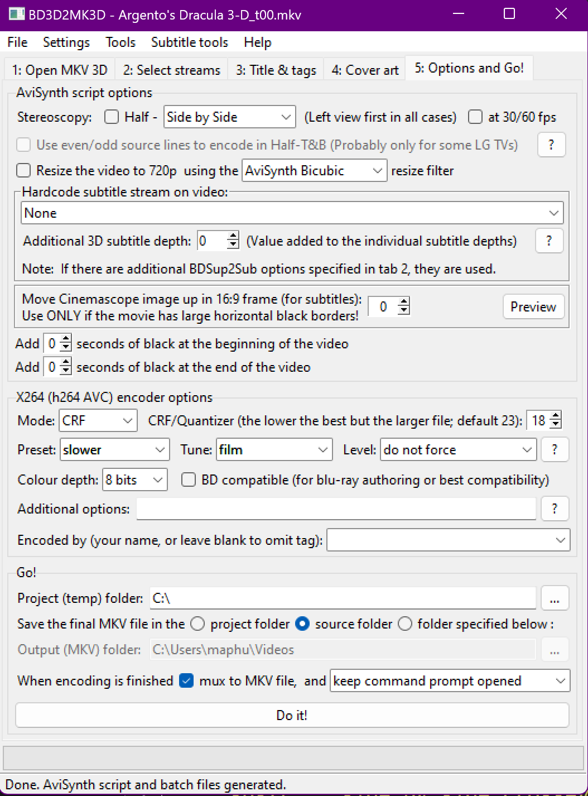
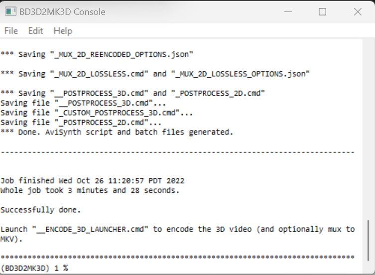
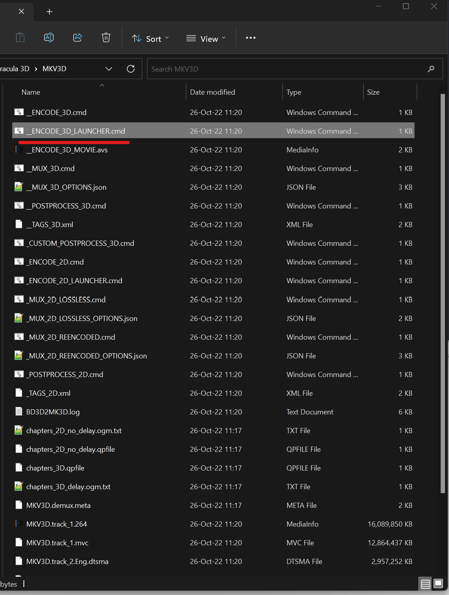
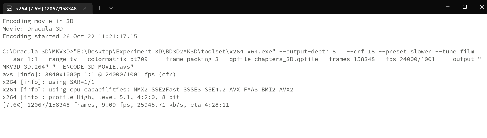

# 3D Movie anaglyph Conversion

  - Convert 3d Blu-ray Discs to anaglyph 3d.
    - I used this process during October since that's when you look most dope in glasses

## Anaglyph Examples 
anaglyph.red_cyan.color


anaglyph.red_cyan.color_optimized


anaglyph.red_cyan.grey


anaglyph.red_cyan.half_colored


## 1. Ripping the Disc
 
- Using a modified Blu-ray Drive I can make backups of my movies using [MakeMKV](https://www.makemkv.com/)
  -  Ensuring to include the 3d element option
- Output is a normal mkv file that can be played as 2D Film
  - The 3D Element is embedded in the file itself. 
- Example Info
    ```
    Stereo High@L4.1/ High@L4.1
        Both Eyes laced in one block (left eye first)
        stereo_mode: block_lr
    ```
  

## 2. Prep file for conversion
 
- It requires some work to get the file ready to be converted to anaglyph 3d.
- Currently, the initial step must be done with the BD3D2MK3D GUI to generate the side by side file.
- **Steps**:
  1) Open file in program
   
  2) Select full side-by-side
  
  
  3) Tune to film and slow with CRF at 18
     - Maybe doesn't need to be so low, but there is still another step of conversion so I like to keep the video as crips as can be 
     - Allow program to finish creating a setup
  
  
  4) A new window opens, choose `__ENCODE_3D_LAUNCHER.cmd`
    - I have this set to be in the same directory as the movie
    - Launching will then generate the file as a side-by-side mkv file
    - For our purposes I used the original 3D movie **House of Wax**
  
  

## 3. Conversion to Anaglyph
- Once we have our prepped file we can now use ffmpeg to convert our file to various versions of anaglyph 3D.
- Below if a script written in python as a wrapper to allow for movies to be converted into a few variance of the red/cyan anaglyph format.

```python
import os
def Convert_to_anagraph_all(movies: dict, stereo_in: dict, stereo_out: dict, delete: bool = False):
    """
    Create 3D anagraph version of movies from a Side-by-side source
        Opens ffmpeg in terminal and does loop
        can output any 3d desired, but is intended for red/cyan anaglyph
    """
    for movie, location in movies.items():
        if delete:
            os.remove(f"{location[:-4]} {{3D}}.mkv")
        print(f'Converting {movie} to 3D')
        for filter_in, info in stereo_in.items():
            for filter_out, info2 in stereo_out.items():
                print(f'Trying out {filter_in}:{filter_out} | {info}:{info2}')
                string = f'ffmpeg -i "{location}" -metadata stereo_mode=block_lr -q 18 -vf stereo3d={filter_in}:{filter_out} -tune film  "{location[:-16]}.{{edition-3D {info2}}}.mkv"'
                os.system(string)
    print('Done')
```

```json
in_stereo = {
    "sbs2l": "side_by_side.parallel.half_width_resolution",
    "sbs2r": "side_by_side.crosseye.half_width_resolution"   
    }
```

```json
out_stereo = {
    "arcg": "anaglyph.red_cyan.gray",
    "arch": "anaglyph.red_cyan.half_colored",
    "arcc": "anaglyph.red_cyan.color",
    "arcd": "anaglyph.red_cyan.color_optimized"
}
```

```python
Convert_to_anagraph_all(movies={"House of Wax": ".\The House of Wax 3D-SBS 1080p.mkv"}, stereo_in=in_stereo, stereo_out=out_stereo)
```

```bash
Converting House of Wax to 3D
Trying out sbs2l:arcg | parallel.half_width_resolution:anaglyph.red_cyan.gray
Trying out sbs2l:arch | sparallel.half_width_resolution:anaglyph.red_cyan.half_colored
Trying out sbs2l:arcc | parallel.half_width_resolution:anaglyph.red_cyan.color
Trying out sbs2l:arcd | parallel.half_width_resolution:anaglyph.red_cyan.color_optimized
Trying out sbs2r:arcg | side_by_side.crosseye.half_width_resolution:anaglyph.red_cyan.gray
Trying out sbs2r:arch | side_by_side.crosseye.half_width_resolution:anaglyph.red_cyan.half_colored
Trying out sbs2r:arcc | side_by_side.crosseye.half_width_resolution:anaglyph.red_cyan.color
Trying out sbs2r:arcd | side_by_side.crosseye.half_width_resolution.red_cyan.color_optimized
Done
```

# Required Programs

 - Programs needed to complete the 3d conversion

### BD3D2MK3D

- [Forum](https://forum.doom9.org/showthread.php?t=177317)
- [Home Page](https://download.videohelp.com/r0lZ/BD3D2AVS/index.html)
- Requires **AviSynth** as a frame server
- Doesn't seem to allow **anaglyph** directly
- Does allow for Side by Side at full size
    - This can then be converted to **anaglyph** later 

### AviSynth

- [Current Release](https://github.com/pinterf/AviSynthPlus/releases)
- [HomePage](https://github.com/pinterf/AviSynthPlus)
- Needed as a frame server for **BD3D2MK3D**
- This some kind of video scripting language
    - the output is video instead of text

### ffmpeg

- Probably not useful for makemkv mkv to 3D direct
    - Will probably need to use BD3DMK3D to use full side by side and then anaglyph

